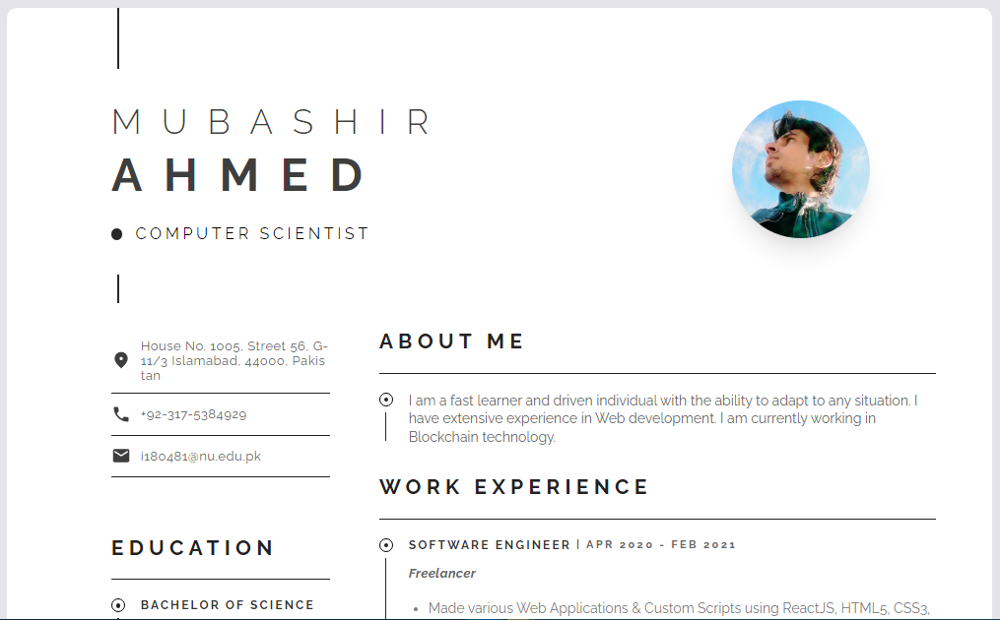

<h1 align="center">
    RESUME (PORTFOLIO WEBSITE)
</h1>

<a href="https://mubashirmalik.github.io/Resume/" target="_blank">Preview/Demo</a>



You can fork this repo to modify and make changes of your own. Please give me proper credit by linking back to MubashirMalik. Thanks!

## Usage Instructions
* Open the project folder and navigate to /src/Resume.js.

* You have to fill some information in Resume.js file to customize your site.

### Example
```
const firstName = "Mubashir"
const lastName = "AhMed"
const jobTitle = "Computer Scientist" // Headline 
const email = "i180481@nu.edu.pk"
    ....
const skills = ["Golang", "C++", "Solidity", "PHP", "ReactJS", "Git & GitHub"]
const interests = ["Dota", "Cricket", "Web3"]
```